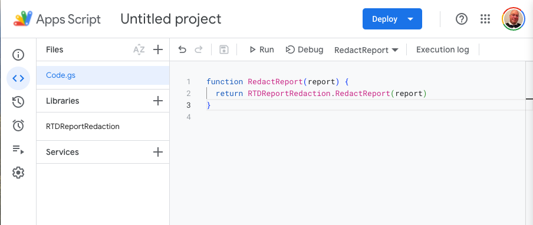

# RTD Report Redaction

## Redact a new sheet

1. Open a new Google sheet and import (copy/paste etc./) the report to redact.
2. Go to **Extensions > Apps script** in the menu.
3. In the editor mode, click on Libraries(+) to add a new script library 
   using the id below: It should show up as **"RTD Report Redaction"** when 
   done.
   > Script Id: **1zywgWFcfM8CLxSRneM-y3MaQOvEfXaFLpq71uSmpKOIwbBt3BHGuyTMB**
4. Now click on `Code.gs` which should have a dummy function in place.
5. Replace the code with the following:

    ```javascript
    function RedactReport(report) {
      return RTDReportRedaction.RedactReport(report)
    }
    ```
You should arrive at this outcome at this point:



6. Now return to the sheet with your data to redact, use the same formula as 
   before:  `=RedactReport(F1)`


Redact away! Add as many sheets as memory will allow, try importing a xls file
directly, voila!

By default, the library is loaded as **"HEAD (Development Mode)"** which 
means any
changes we make LIVE in the source script, will come through when saved. If
there is an error introduced by making changes in the source script, 
double-click on the library name and select the HIGHEST version number 
available to return to a published version.

> **HINT:** Maybe you start with the highest number for now regardless.
